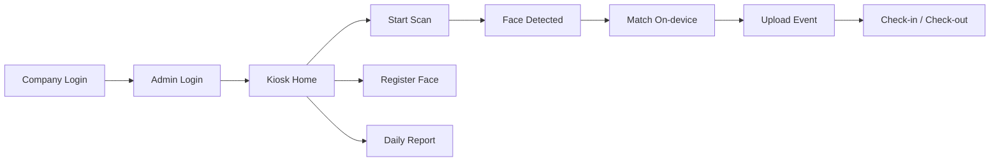

<div align="center">


# TTStaffPro Face Attendance — Kiosk

**One face-scan screen. Every staff member checked in & out.**

Always-on kiosk app for single-point face attendance on a wall-mounted tablet.
Staff look at the camera → recognised → check-in / check-out → synced to the
tenant admin panel automatically.

<!-- Badges -->
[](https://flutter.dev)
[](https://dart.dev)
[](pubspec.yaml)
[](android/)
[](https://developers.google.com/ml-kit/vision/face-detection)

</div>

---

## ✨ Why this app?

Like a **biometric device** — one kiosk, one face-scan screen, and every staff
member of the tenant punches in/out with their face. No cards, no PINs, no
separate logins for each employee.

| Traditional biometric | TTStaffPro Kiosk |
|---|---|
| Fingerprint device + enrolment software | 📱 Tablet + face scan |
| Admin manages device separately | 🔐 Admin logs in with normal TTStaffPro account |
| Scans only fingerprints | 😀 On-device ML Kit face matching |
| Manual export to payroll | 🔄 Auto-syncs to attendance module |

---

## 🎯 Features

- 🧑‍🤝‍🧑 **Single scan screen** — all tenant staff check in/out at one place
- 🔐 **Tenant admin login** — use the normal TTStaffPro admin email/password (Sanctum token)
- 👤 **On-kiosk face registration** — pick employee → capture front/left/right → enrolled instantly
- 📷 **On-device face matching** — ML Kit landmark signatures, no cloud dependency
- 📴 **Offline queue** — events saved to Hive, auto-synced when network returns
- ⚡ **Always-on display** — `wakelock_plus` + immersive mode + `FLAG_KEEP_SCREEN_ON`
- 🎨 **Dark / Light / System theme** — user-selectable, persisted
- 🖥️ **Daily report** — date-wise staff list with check-in/out, late & early flags
- 🏷️ **Branded** — TTStaffPro logo, Poppins font, employee-app design system (`#696CFF`)

---

## 🚀 How it works



1. **Company login** — operator types the company name → `POST /kiosk/company-match`
2. **Admin login** — tenant admin email + password → `POST /kiosk/login` (Sanctum token)
3. **Kiosk home** — live clock, **Start Scan**, **Register Face**, **Daily Report**, pending-sync indicator
4. **Scan screen** — camera stays on; matched face uploads a recognition event → `POST /device/events`; server resolves check-in/check-out; auto re-arms for the next person
5. **Offline** — events queue in Hive, flushed on reconnect
6. **Daily report** — `GET /kiosk/report?date=...` with late/early flags

---

## 🧠 Tech Stack

| Layer | Technology |
|---|---|
| Framework | [Flutter](https://flutter.dev) 3.x · Dart `^3.12.2` |
| Face detection | [`google_mlkit_face_detection`](https://pub.dev/packages/google_mlkit_face_detection) (landmark signatures) |
| Camera | [`camera`](https://pub.dev/packages/camera) |
| Networking | [`dio`](https://pub.dev/packages/dio) + shared `open_core_hr` Dio client |
| Offline storage | [`hive`](https://pub.dev/packages/hive) + `hive_flutter` |
| Settings | `shared_preferences` |
| Keep-awake | [`wakelock_plus`](https://pub.dev/packages/wakelock_plus) |
| State | `ValueNotifier` / MobX (via shared `open_core_hr`) |

> ⚠️ **Monorepo note** — this app lives at `apps/ttstaffpro_face_attendance` and
> reuses the root **`open_core_hr`** package through a local path dependency
> (`path: ../..`) for its API repositories, models and Dio client with device
> headers. It adds its own kiosk flow, offline queue and screen-wake management.

---

## 📁 Project Structure

```
lib/
├── main.dart                    # App bootstrap (init, watchdog, theme)
├── kiosk/
│   ├── kiosk_service.dart       # Company match, login, enroll, sync, report
│   ├── face_matcher.dart        # On-device ML Kit face matching
│   ├── kiosk_settings.dart      # Settings (company, theme, device)
│   ├── kiosk_theme.dart         # Dark/Light palettes + theme builder
│   └── offline_store.dart       # Hive offline event queue
└── screens/
    ├── splash_screen.dart       # Branded splash
    ├── company_login_screen.dart# Company name → tenant
    ├── master_login_screen.dart # Tenant admin login
    ├── kiosk_home_screen.dart   # Home: scan / register / report
    ├── kiosk_scan_screen.dart   # The one face-scan screen
    ├── kiosk_register_face_screen.dart  # Employee face enrolment
    └── kiosk_report_screen.dart # Daily attendance report
```

---

## 🔌 API Integration

All endpoints are served under `V1/face-attendance/...` by the Laravel backend.

| Method | Endpoint | Purpose |
|---|---|---|
| `POST` | `kiosk/company-match` | Resolve company → tenant |
| `POST` | `kiosk/login` | Tenant admin login → Sanctum token |
| `GET`  | `kiosk/employees` | Active employees for face registration |
| `POST` | `kiosk/enroll` | Enrol employee face (min 3 images) |
| `GET`  | `kiosk/report?date=` | Daily attendance report |
| `POST` | `device/register` | Register this kiosk device |
| `POST` | `device/heartbeat` | Keep device online |
| `GET`  | `device/profile-package` | Face profile package (version) |
| `GET`  | `device/profile-package/download` | Download face profiles |
| `POST` | `device/events` | Push recognition event (check-in/out) |
| `POST` | `device/sync-batch` | Batch sync offline events |

---

## 🛠️ Getting Started

### Prerequisites
- Flutter 3.x + Dart `^3.12.2`
- Android Studio / Android SDK (API 21+)
- The parent repo root containing the `open_core_hr` package (local path dep)

### Run

```bash
cd apps/ttstaffpro_face_attendance
flutter pub get
flutter run
```

### Build release APK (for the tablet)

```bash
flutter build apk --release
# output: build/app/outputs/flutter-apk/app-release.apk
```

> The app uses core-library **desugaring** (required by
> `flutter_local_notifications` via `open_core_hr`), already configured in
> `android/app/build.gradle.kts`.

---

## ✅ Tests

```bash
flutter test
flutter analyze
```

---

## 🤝 Contributing

1. Fork the repo and create a feature branch
2. Make your change & keep `flutter analyze` clean
3. Open a Pull Request with a clear description

---

<div align="center">

**Built with 💜 by the TTStaffPro team**

© TTStaffPro — TT Staff Pro HRMS

</div>

