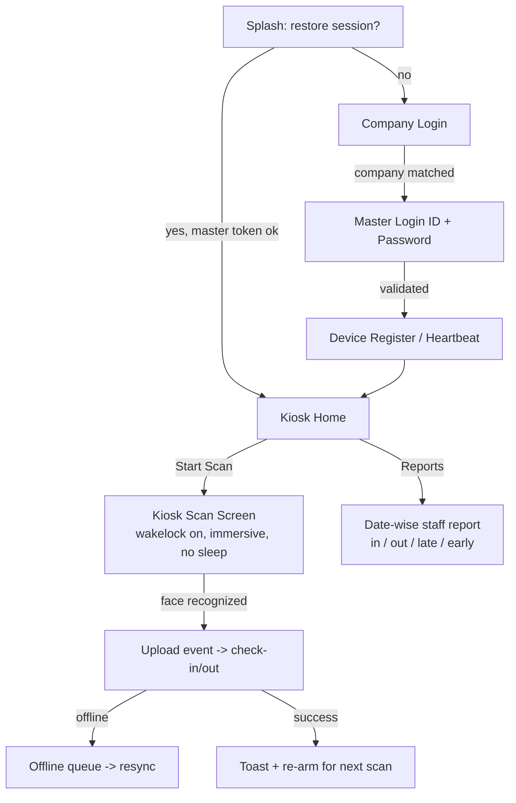

# Face Attendance — Implementation Plan & API Contract

> Scope: wall-mounted tablet kiosk for single-point face attendance, staff face
> registration in the employee app, and sync of check-in/check-out into the
> existing attendance module of the employee & sales apps.

Applies to:

- **Kiosk app** — `apps/ttstaffpro_face_attendance` (Android tablet, always-on)
- **Employee app** — `open_core_hr` (staff self-registration + admin list)
- **Backend** — Laravel `ttstaffpro.in/api/V1` (contract defined; implement server-side)

---

## 1. Requirements → Implementation mapping

| # | Requirement | Where | Status |
|---|-------------|-------|--------|
| 1 | Match company name on login | Kiosk `CompanyLoginScreen` → `POST face-attendance/kiosk/company-match` | ✅ implemented |
| 2 | "Add your face" staff registration button | Employee app `FaceRegistrationScreen` (Settings + Home module) → `POST face-attendance/self/register` | ✅ implemented |
| 3 | List of done / pending face registrations | Employee app `FaceRegistrationAdminScreen` → `GET face-attendance/admin/profiles` (filter `status`) | ✅ implemented |
| 4 | Done registrations sync to staff login | Backend links `face_profiles.employee_id` → user; app refreshes `self/profile` after login | ✅ implemented |
| 5 | Master login for single tablet + always-on scan (no sleep) | Kiosk `MasterLoginScreen` → `POST face-attendance/kiosk/login`; `KioskScanScreen` uses wakelock + immersive + `FLAG_KEEP_SCREEN_ON` | ✅ implemented |
| 6 | Face scan → check-in / check-out, date-wise report | Kiosk `KioskScanScreen` uploads event → `POST face-attendance/device/events` (server resolves `attendance` → in/out); `KioskReportScreen` shows date-wise in/out | ✅ implemented |
| 7 | Staff-wise attendance report synced to employee & sales app modules | Server persists events as attendance; both apps read existing `/attendance/...` endpoints | ✅ implemented |
| 8 | Late check-in / early check-out auto-computed in reports | Server compares `check_in` vs shift start, `check_out` vs shift end; report flags `late` / `early` via existing `Attendance` late/early attributes | ✅ implemented |

> Backend (Laravel 12 / PHP 8.4) implemented 2026-08 in `Modules/FaceAttendanceKiosk` on `ttstaffpro.in`:
> `KioskController` (company-match / login / report), `KioskAuthService`, `FaceKioskOperator` + `FaceKioskSession` models, migrations `face_kiosk_operators` + `face_kiosk_sessions` (applied to all 9 tenant DBs), routes under `V1/face-attendance/kiosk/...`, device `/register` gated by master token, events accept `eventType=attendance` (server decides check-in/out). Master operator: `ttstaffpro` / `12345678` (all tenants). Note: this backend does NOT use `stancl/tenancy` — routes must rely on the global `api` group's `ApiTenantContext` (header `X-Tenant-ID`) instead of the (non-existent) `Stancl\Tenancy\...` middleware; that pre-existing bug was fixed in the module routes.

`✅ app side` = implemented in this repo. `⚙️ server` = Laravel contract below.

---

## 2. Kiosk app flow

Key behaviours:

- **Always-on**: `WakelockPlus.enable()` + `SystemChrome.setEnabledSystemUIMode(immersiveSticky)`
  + Android activity `android:keepScreenOn="true"` and `FLAG_KEEP_SCREEN_ON`.
- **Auto re-arm**: after each successful scan the camera stays live and waits for
  the next face; no taps required between scans.
- **Offline-first**: recognition events are written to a local Hive queue with a
  UUID; a sync worker flushes the queue when connectivity returns.
- **Session**: master token + device UUID/token persisted in SharedPreferences;
  `AuthInterceptor` already forwards `X-Device-UUID` / `X-Device-Token` headers.

---

## 3. Backend API contract (Laravel, prefix `face-attendance`)

### Existing (already used by repo)
| Method | Route | Purpose |
|--------|-------|---------|
| GET | `/admin/profiles` | List profiles; `status` filter: `pending` / `approved` / `rejected` |
| POST | `/admin/profiles/{id}/approve\|reject\|reset\|re-enroll` | Admin actions |
| GET | `/self/eligibility` | Can current user register |
| POST | `/self/register` | Multipart `images[]`, `captureTypes[]` |
| GET | `/self/profile` | Own profile status + image URLs |
| POST | `/device/register` | Returns `deviceId`, `deviceToken` |
| POST | `/device/heartbeat` | Kiosk keep-alive (battery, network) |
| GET | `/device/profile-package` | Version + `downloadRequired` |
| GET | `/device/profile-package/download` | Enrolled profile images for on-device matching |
| POST | `/device/events` | Multipart `snapshot` + fields; returns `attendanceAction` (check_in/check_out) + `attendanceId` |
| POST | `/device/sync-batch` | Offline event batch |
| GET | `/admin/dashboard` , `/admin/audit-log` | Admin ops |

### New (required by this plan — implement server-side)
| Method | Route | Body / Params | Response |
|--------|-------|---------------|----------|
| POST | `/kiosk/company-match` | `{ "companyName": "..." }` | `{ "ok": true, "company": { "id", "name", "logoUrl" }, "tenants": [...] }` |
| POST | `/kiosk/login` | `{ "companyId", "username", "password" }` | `{ "token" (master), "deviceRequired": true }` |
| POST | `/kiosk/device-token` | `{ "companyId", "deviceUuid" }` + master token | `{ "deviceToken" }` |
| GET | `/kiosk/report?date=YYYY-MM-DD` | device token | `{ "rows": [ { "employeeId", "employeeName", "checkIn", "checkOut", "isLate", "isEarly" } ] }` |

### Sync into existing attendance module (requirement 7 & 8)
When `/device/events` is processed and `attendanceAction == check_in`, the server
should create/update the same attendance record used by the employee & sales apps
(`attendances` table), so those apps automatically show it and the existing
late/early logic (shift start/end comparison) applies. No client change needed in
the employee/sales apps beyond what is already wired via `in_out_component.dart`.

---

## 4. Data model additions (client)

Kiosk local persistence:

- `KioskSettings` (SharedPreferences): `companyName`, `companyId`, `masterToken`,
  `deviceUuid`, `deviceToken`, `lastHeartbeatAt`.
- `PendingFaceEvent` (Hive box `kiosk_pending_events`): `eventUuid`, `eventType`,
  `employeeId`, `snapshotPath`, `occurredAt`, `createdAt`, `status`.

---

## 5. Deliverables in this repo

- `apps/ttstaffpro_face_attendance/` — full kiosk app (company login, master login,
  always-on scan, daily report, offline queue). No screen sleep via wakelock,
  immersive mode and `FLAG_KEEP_SCREEN_ON`.
- `lib/screens/FaceAttendance/face_registration_admin_screen.dart` — done/pending list
  with approve/reject actions.
- `lib/screens/FaceAttendance/face_registration_screen.dart` — "Add your face" flow
  (self-registration + status).
- Wire-up in `Settings` + `Home` module grid gated by `isFaceAttendanceModuleEnabled()`.
- `lib/api/api_routes.dart` + `FaceAttendanceRepository` — new kiosk endpoints
  (`company-match`, `login`, `device-token`, `report`).
- `lib/models/face_attendance/kiosk_model.dart` — kiosk DTOs.
- Unit tests: `test/face_attendance_repository_test.dart` (+3 kiosk tests),
  `apps/ttstaffpro_face_attendance/test/widget_test.dart`.

## 6. Build & deploy notes

- **Kiosk APK**: `cd apps/ttstaffpro_face_attendance && flutter build apk --release`.
  Install on the wall-mounted tablet, grant camera permission, log in with the
  company name then the master credentials. The screen stays awake automatically.
- **Employee app**: existing build flow. Face Attendance must be enabled in
  Modules (`ModulesScreen`) for the Settings/Home entries to appear.
- **Server work still required** (outside this repo): implement the four new
  `/kiosk/*` endpoints and make `/device/events` upsert attendance so the
  employee & sales apps show the records with late/early flags.

